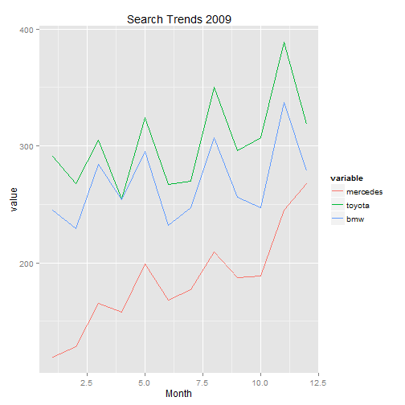
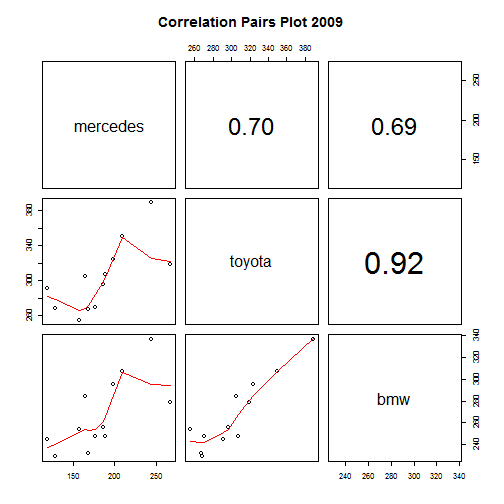

Trendify - Automotive Trends Demystified
========================================================
author: Vehicle Brand Search Trends in South Africa (2004-2014)
date: Mon Nov 24 23:54:21 2014
date: Tue Nov 25 00:20:52 2014
transition: rotate
css: custom.css

Why it matters
========================================================
type: custom1
<p>The automotive market in South Africa is a hotly contested one.  With the myriad of brands available to the average consumer and more entering the market as trade with the BRICS countries increases, it has become vitally important to provide your automotive customers with insights into their own brand strength and the brand strength of their top competitors. <p>Search trend analysis is a tool that can aid you in providing your customer with relevant information on the movement within their markets.

<h4>Trendify provides the following key indicators:  </h4>
* An easy comparison of vehicle make search trends from Google Trends in a given year, based on number of searches for the brand term per month.  
* Basic correlation plots for quick insights into potential mavericks that were not on the radar.  
* Comparison summary statistics on the selected brands.  

Case Study - Global Financial Crisis
========================================================
type: custom2
 
***
 


Gaining Insights
========================================================
type: custom3

<p>The impact of the Global Financial Crisis in 2008 and 2009 hit the automotive industry hard.  Search volume on more affordable vehicles such as Toyota remained fairly steady with an upward trend towards the end of 2009.  The surprising insight is that interest in luxury brands such as the Mercedez climbed from a low base of only 119 searches in January, to 268 in December.  Conversely, the number of searches for BMW and Toyota dropped sharply in December to end the year at a similar point than it started in January.  


```
    mercedes       toyota         bmw     
 Min.   :119   Min.   :255   Min.   :229  
 1st Qu.:163   1st Qu.:270   1st Qu.:246  
 Median :182   Median :300   Median :255  
 Mean   :184   Mean   :303   Mean   :268  
 3rd Qu.:202   3rd Qu.:320   3rd Qu.:287  
 Max.   :268   Max.   :389   Max.   :337  
```

<p>Data such as this can be used to spark questions and debate, which in turn leads to the synthesis of ideas and generation of insigths ... which is exactly what your customer needs to in form their marketing and advertising strategies for the year ahead.

Conclusion
========================================================
type: custom4
<p>Trendify gives you the tools to explore your customers market, generate business insights and to come to the table with innovations and ideas.  This allows you to become something more than a service provider; you become a valued partner in their business.

<p>Try out [Trendify](http://chaendryn.shinyapps.io/Trendify) at [http://chaendryn.shinyapps.io/Trendify](http://chaendryn.shinyapps.io/Trendify). 

<h4>Looking ahead:</h4>

<p>A sneak peak of features in the pipeline for Trendify 
* Customisable trend data searches allowing the comparison of up to 4 user selected search terms to uncover hidden influencers.  
* More analysis tools such as statistical model fitting.  


